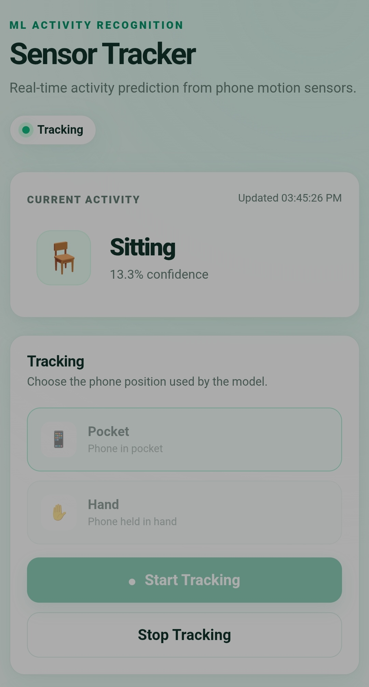
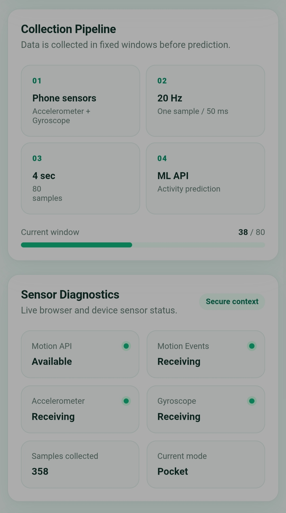
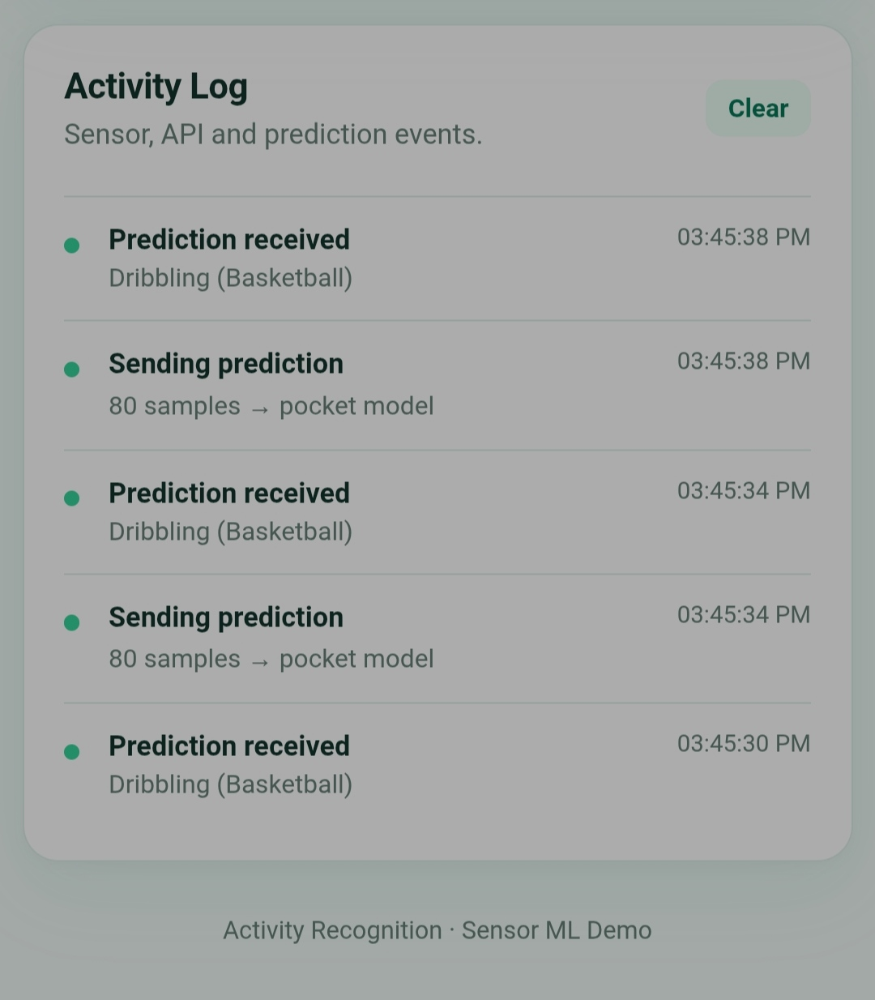

# 📱 WISDM Activity Predictor

A machine learning project for recognizing human activities using motion data from smartphones and smartwatches.

This project uses the **WISDM Smartphone and Smartwatch Activity and Biometrics Dataset** to train models for recognizing 18 different activities from accelerometer and gyroscope data.

What started as a few experiments in notebooks eventually became a reproducible pipeline that handles dataset preparation, feature extraction, hyperparameter tuning, model training, evaluation, and finally exposes the trained models through a FastAPI backend.

The project also includes a small browser-based demo that can collect live motion data from a phone and send it to the API for prediction.

---

## ✨ Highlights

- 📱 Activity recognition using smartphone sensors
- ⌚ Activity recognition using smartwatch sensors
- 📱⌚ Combined smartphone + smartwatch models
- ⚙️ Automated preprocessing and feature extraction
- 🎛️ Hyperparameter tuning with Optuna
- 🔁 3-fold cross-validation
- 🔒 Completely held-out test set for final evaluation
- 📊 Classification reports and confusion matrices
- 🚀 FastAPI inference API
- 🌐 Browser-based sensor demo
- 📡 Live accelerometer + gyroscope data collection

---

## 🧠 The Idea

Human Activity Recognition (HAR) is the task of identifying what a person is doing based on sensor measurements.

A phone or smartwatch can continuously measure movement using sensors such as:

- Accelerometer
- Gyroscope

The idea is that different activities produce different patterns in these signals.

For example, walking, sitting, typing, and jogging produce very different motion characteristics.

This project uses those characteristics to classify sensor windows into one of **18 activities**.

### Activities

| Label | Activity                    |
| ----- | --------------------------- |
| A     | Walking                     |
| B     | Jogging                     |
| C     | Stairs                      |
| D     | Sitting                     |
| E     | Standing                    |
| F     | Typing                      |
| G     | Brushing Teeth              |
| H     | Eating Soup                 |
| I     | Eating Chips                |
| J     | Eating Pasta                |
| K     | Drinking from Cup           |
| L     | Eating Sandwich             |
| M     | Kicking (Soccer Ball)       |
| O     | Playing Catch w/Tennis Ball |
| P     | Dribbling (Basketball)      |
| Q     | Writing                     |
| R     | Clapping                    |
| S     | Folding Clothes             |

---

# 🔬 Dataset

The project uses the **WISDM Smartphone and Smartwatch Activity and Biometrics Dataset**.

The dataset contains motion sensor recordings collected from participants performing different activities using both smartphones and smartwatches.

For this project, the data was separated into three configurations:

| Model     | Input                                |
| --------- | ------------------------------------ |
| 📱 Phone  | Smartphone accelerometer + gyroscope |
| ⌚ Watch  | Smartwatch accelerometer + gyroscope |
| 📱⌚ Both | Smartphone + smartwatch sensors      |

An important part of the experiment was keeping the users out of the final feature representation.

The goal was to recognize the **activity from movement**, rather than recognize the person who produced the movement.

---

# ⚙️ Preprocessing & Feature Engineering

The preprocessing pipeline converts the raw sensor recordings into fixed-size samples that can be used by a traditional machine learning model.

The sensor streams are divided into **4-second windows sampled at 20 Hz**, giving each window approximately 80 samples per sensor axis.

From each window, statistical and frequency-domain features are extracted.

The current feature set includes:

- Mean
- Standard deviation
- 25th percentile
- 75th percentile
- Kurtosis
- Lag-1 autocorrelation
- RMS
- Dominant frequency
- Spectral energy

These features are calculated across the available sensor axes and form the final feature vector used by the classifier.

The preprocessing and feature engineering steps are intentionally kept together in `src/Preprocessing.py`, since the feature dataset cannot be created without first organizing and windowing the raw sensor recordings.

---

# 🤖 Model

The final classifier is a **Random Forest**.

I chose a feature-based approach rather than a deep learning model for this project. The goal was to understand the complete machine learning workflow first, including data preparation, feature engineering, model selection, tuning, and evaluation.

Hyperparameter tuning is performed using **Optuna**, with **macro F1** as the optimization metric.

The training pipeline uses **3-fold cross-validation** when evaluating configurations during training.

The main training workflow is implemented in:

```text
src/
├── Preprocessing.py
├── tune.py
├── train.py
├── validate_on_test.py
└── ...
```

---

# 🔒 Evaluation

One of the things I wanted to be particularly careful about was the final evaluation.

The training and test data were kept in separate files.

The test dataset was not used during preprocessing decisions, hyperparameter tuning, model selection, or cross-validation.

The workflow was essentially:

```text
Training Data
     │
     ├── Preprocessing
     ├── Feature Engineering
     ├── Hyperparameter Tuning
     └── Cross Validation
              │
              ▼
         Final Model
              │
              ▼
       Held-out Test Data
              │
              ▼
       Final Evaluation
```

The cross-validation reports are generated by `train.py`.

The final held-out test results are generated separately by `validate_on_test.py`.

This separation is important because it gives a more honest estimate of how the final model performs on data it never saw during development.

---

# 📊 Results

The final held-out test results are:

| Sensor Configuration | F1 Score |
| -------------------- | -------: |
| 📱 Phone             | **0.87** |
| ⌚ Watch             | **0.83** |
| 📱⌚ Phone + Watch   | **0.91** |

The combined model performed best, reaching an F1 score of approximately **0.91** on the held-out test set.

The watch-only model performed slightly worse than the phone model, which was one of the more interesting results from the experiment.

The results also show that combining the two sensor sources provides useful additional information compared with either device alone.

---

# 📈 Detailed Results

The repository contains the complete evaluation output in [`reports/`](reports/).

For each model there are:

- Cross-validation classification reports
- Cross-validation confusion matrices
- Held-out test classification reports
- Held-out test confusion matrices

### 📱 Phone

| Evaluation       | Report                                                                           | Confusion Matrix                                                       |
| ---------------- | -------------------------------------------------------------------------------- | ---------------------------------------------------------------------- |
| Cross-validation | [`classification_report.txt`](reports/phone/classification_report.txt)           | [`confusion_matrix.png`](reports/phone/confusion_matrix.png)           |
| Held-out test    | [`classification_report_test.txt`](reports/phone/classification_report_test.txt) | [`confusion_matrix_test.png`](reports/phone/confusion_matrix_test.png) |

### ⌚ Watch

| Evaluation       | Report                                                                           | Confusion Matrix                                                       |
| ---------------- | -------------------------------------------------------------------------------- | ---------------------------------------------------------------------- |
| Cross-validation | [`classification_report.txt`](reports/watch/classification_report.txt)           | [`confusion_matrix.png`](reports/watch/confusion_matrix.png)           |
| Held-out test    | [`classification_report_test.txt`](reports/watch/classification_report_test.txt) | [`confusion_matrix_test.png`](reports/watch/confusion_matrix_test.png) |

### 📱⌚ Phone + Watch

| Evaluation       | Report                                                                          | Confusion Matrix                                                      |
| ---------------- | ------------------------------------------------------------------------------- | --------------------------------------------------------------------- |
| Cross-validation | [`classification_report.txt`](reports/both/classification_report.txt)           | [`confusion_matrix.png`](reports/both/confusion_matrix.png)           |
| Held-out test    | [`classification_report_test.txt`](reports/both/classification_report_test.txt) | [`confusion_matrix_test.png`](reports/both/confusion_matrix_test.png) |

---

# 📱 Demo

The project also contains a small end-to-end demo connecting the trained models to real sensor data.

The demo consists of:

- A **FastAPI backend**
- A lightweight HTML/CSS/JavaScript frontend
- Browser motion sensors
- The trained Random Forest models

The frontend collects:

- Accelerometer data including gravity
- Gyroscope data

Sensor samples are collected at approximately **20 Hz**.

Instead of making a prediction from every individual measurement, the frontend builds a batch of sensor samples and periodically sends the complete window to the API.

The default setup uses a **4-second window**, giving roughly 80 samples per request.

The API then performs the same feature extraction process and uses the appropriate trained model to produce the activity prediction.

---

## ✋ Hand / Pocket Modes

The demo supports two modes:

- **Pocket**
- **Hand**

The selected mode is sent as part of the API request.

This allows the backend to select the appropriate model for the way the phone is being used.

The API accepts a sensor batch in the following general form:

```json
{
  "data": [
    {
      "timeStamp": 123456789,
      "x_accel": 0.12,
      "y_accel": -0.43,
      "z_accel": 9.71,
      "x_gyro": 0.01,
      "y_gyro": -0.02,
      "z_gyro": 0.03
    }
  ]
}
```

---

# 🖥️ Demo Screenshots

The frontend was designed as a small, clean interface rather than a full application.

It provides:

- Current activity prediction
- Start / stop tracking
- Hand / Pocket selection
- Sensor availability status
- Prediction history
- Event logging

<p align="center">
  
</p>

<p align="center">
  
</p>

<p align="center">
  
</p>

---

# 🚀 Running the Demo

The demo is **not currently hosted online**.

Instead, it is included in the repository so that it can be run locally.

Because the demo needs a secure context between the front-end and the back-end,\
The easiest way I tested the demo was using an Android phone connected to the development machine through
**ADB wireless debugging**.

## 🖥️ 1. Install ADB

The demo requires **Android Debug Bridge (ADB)** to connect the development computer to an Android phone.

ADB is included with the **Android SDK Platform Tools**.

### Windows

Using **WinGet**:

```powershell
winget install Google.PlatformTools
```

Or using **Scoop**:

```powershell
scoop install adb
```

Verify the installation:

```powershell
adb --version
```

### macOS

Using **Homebrew**:

```bash
brew install android-platform-tools
```

Verify:

```bash
adb --version
```

### Linux

On Debian/Ubuntu-based distributions:

```bash
sudo apt install adb
```

On Arch Linux:

```bash
sudo pacman -S android-tools
```

Verify:

```bash
adb --version
```

If your package manager does not provide ADB, you can download the **Android SDK Platform Tools** directly from the official Android developer website:

[Android SDK Platform Tools](https://developer.android.com/tools/releases/platform-tools?utm_source=chatgpt.com)

---

## 📱 2. Enable Developer Mode on Android

On your Android phone:

1. Open **Settings**
2. Find **About phone**
3. Find **Build number**
4. Tap **Build number** several times until Developer Options are enabled

The exact location can vary between Android versions and manufacturers.

---

## 📡 3. Enable Wireless Debugging

Open:

**Settings → Developer options → Wireless debugging**

Enable **Wireless debugging**.

Make sure the phone and development computer are connected to the same local network.

---

## 🔗 4. Pair the Phone with ADB

From your computer, run:

```bash
adb pair <PHONE_IP>:<PAIRING_PORT>
```

Android will display a pairing code. Enter it when ADB asks for it.

For example:

```bash
adb pair 192.168.1.20:37123
```

After successful pairing, connect to the debugging address shown by Android:

```bash
adb connect <PHONE_IP>:<DEBUG_PORT>
```

For example:

```bash
adb connect 192.168.1.20:41235
```

You can check that the device is connected with:

```bash
adb devices
```

Your phone should appear in the list.

> The pairing port and debugging port are not necessarily the same. Use the values displayed by your phone under Wireless Debugging.

---

## 🔄 5. Forward the FastAPI Server to the Phone

Once the phone is connected through ADB, run:

```bash
adb reverse tcp:8000 tcp:8000
```

This forwards port `8000` on the phone to port `8000` on your computer.

This is useful because the phone can now access the FastAPI server running on your development machine through:

```text
localhost:8000
```

---

## 🚀 6. Start the Backend

From the project directory, install the dependencies:

```bash
pip install -r requirements.txt
```

Then start the FastAPI server:

```bash
python demo/main.py
```

Once the server is running and the ADB reverse connection is active, open the following address **on the phone**:

```text
http://localhost:8000
```

The demo should now be accessible from the phone while the FastAPI backend continues running on the computer.

---

## 🍎 iOS

**Work in progress.**

I have not finished the iOS setup yet but i am working on a setup that works rn.

The Android setup above is the configuration currently tested with the demo.

---

# ⚠️ Real-World Testing

The offline evaluation results are good, but there is an important distinction between those results and the live demo.

When I tested the system using sensor data collected directly from my own phone, the demo performed considerably worse than the results on the WISDM test set.

During testing, I noticed that the shape and characteristics of the sensor signals could change depending on how the phone was held and oriented.

This means that the data produced by a real phone is not necessarily distributed in the same way as the data used to train the model.

In other words:

**Good test-set performance does not automatically mean good real-world performance.**

This was probably the most useful lesson from the project.

The model performs well when evaluated under the same general conditions as the dataset it was trained on, but real-world sensor data introduces additional variation that the current training data does not fully cover.

Possible ways to improve this would include:

- Collecting data from more devices
- Including different phone orientations
- Developing more orientation-independent features
- Collecting additional real-world training data
- Investigating normalization techniques

For the scope of this project, I decided to keep the live application as a demonstration of the complete inference pipeline rather than trying to turn it into a production-ready HAR system.

---

# 🔁 Reproducible Pipeline

One of the main improvements I made during development was moving away from a workflow that depended entirely on notebooks.

The notebooks were useful for:

- Exploring the dataset
- Understanding the sensor signals
- Experimenting with features
- Testing different models
- Visualizing results

Once the approach became more stable, the important parts were moved into scripts.

The resulting workflow can be run as a pipeline:

```text
Dataset                         #download_data.py
   ↓
Preprocessing                   #preprocessing.py
   ↓
Feature Extraction              #preprocessing.py
   ↓
Hyperparameter Tuning           #tune.py
   ↓
Training + Cross Validation     #train.py
   ↓
Final Model
   ↓
Held-out Test Evaluation        #validate_on_test.py
```

feel free to run the scripts and experiment with them!

---

# 🧰 Scripts & Usage

The main ML workflow is split into separate scripts so that each stage can be run independently.

## `download_data.py`

Downloads the WISDM dataset and prepares the raw data directory.

```bash
python src/download_data.py
```

## `Preprocessing.py`

Handles the main data preparation and feature extraction process.

It:

- Loads the raw sensor data
- Groups the data by user and activity
- Creates fixed-size sensor windows
- Extracts statistical and frequency-domain features
- Produces the feature datasets used by the training pipeline

The preprocessing script accepts the input/output paths and sensor configuration so that phone, watch, and combined datasets can be generated independently.

```bash
python src/Preprocessing.py --help
```

## `tune.py`

Runs hyperparameter optimization using **Optuna**.

The optimization uses **macro F1** as the objective and performs cross-validation on the training data.

```bash
python src/tune.py --help
```

The resulting parameters are saved and can then be used by the training stage.

## `train.py`

Trains the final Random Forest model using the selected parameters.

The script also performs **3-fold cross-validation** and generates the classification report and confusion matrix found in `reports/`.

```bash
python src/train.py --help
```

The model can be trained separately for each sensor configuration:

- `phone`
- `watch`
- `both`

## `validate_on_test.py`

Runs the final evaluation against the **held-out test set**.

This script is intentionally separate from `train.py` so that the test set remains untouched during training and model selection.

```bash
python src/validate_on_test.py --help
```

The resulting classification report and confusion matrix are saved separately from the cross-validation results.

---

## 🔧 Script Parameters

Most scripts expose their configuration through command-line arguments and also some values that is shared between\
scripts which are in `config.py` such as the window size.

For example:

```bash
python src/Preprocessing.py --help
```

will show the available options for the preprocessing stage.

This makes it possible to reproduce the experiments with different sensor configurations, input files, output locations, and other parameters without modifying the scripts themselves.

For a complete list of options, run:

```bash
python src/<script>.py --help
```

for the corresponding script.

and also check the `config.py`

---

# 🗂️ Project Structure

```text
wisdm-activity-predictor/
│
├── demo/                   # FastAPI backend and web demo
│
├── models/                 # Trained models
│   └── params/             # Model parameters
│
├── notebooks/              # Exploration and experimentation
│
├── reports/                # Classification reports and confusion matrices
│   ├── phone/
│   ├── watch/
│   └── both/
│
├── screenshots/            # Demo screenshots
│
├── src/
│   ├── Preprocessing.py    # Data preparation and feature extraction
│   ├── train.py            # Model training and CV evaluation
│   ├── tune.py             # Hyperparameter tuning
│   ├── transformers.py     # Data transformation utilities
│   ├── validate_on_test.py # Final held-out test evaluation
│   └── ...
│
├── requirements.txt
├── LICENSE
└── README.md
```

---

# 🛠️ Tech Stack

### Machine Learning

- Python
- NumPy
- Pandas
- scikit-learn
- Optuna
- Joblib

### Backend

- FastAPI
- Pydantic
- Uvicorn

### Frontend

- HTML
- CSS
- JavaScript

### Development

- Jupyter Notebook
- Git
- GitHub

---

# 🔮 Future Improvements

There are several directions this project could be taken further:

- Collect more real-world sensor data
- Improve robustness to phone orientation
- Test the models across multiple physical devices
- Investigate more orientation-independent features
- Improve the live prediction pipeline
- Compare additional classical ML algorithms
- Experiment with time-series / deep learning approaches
- Investigate domain adaptation between the WISDM dataset and real-world sensor data

---

# 📚 Dataset

This project uses the **WISDM Smartphone and Smartwatch Activity and Biometrics Dataset**.

[dataset](https://archive.ics.uci.edu/dataset/507/wisdm+smartphone+and+smartwatch+activity+and+biometrics+dataset)

---

# 📄 License

This project is licensed under the MIT License.

See [`LICENSE`](LICENSE) for more information.

---

⭐ If you found the project interesting, feel free to explore the source code, notebooks, reports, and demo.

[1]: https://docs.github.com/en/contributing/writing-for-github-docs/creating-diagrams-for-github-docs?utm_source=chatgpt.com "Creating diagrams for GitHub Docs - GitHub Docs"
[2]: https://docs.github.com/en/repositories/managing-your-repositorys-settings-and-features/customizing-your-repository/about-readmes?utm_source=chatgpt.com "About the repository README file - GitHub Docs"
